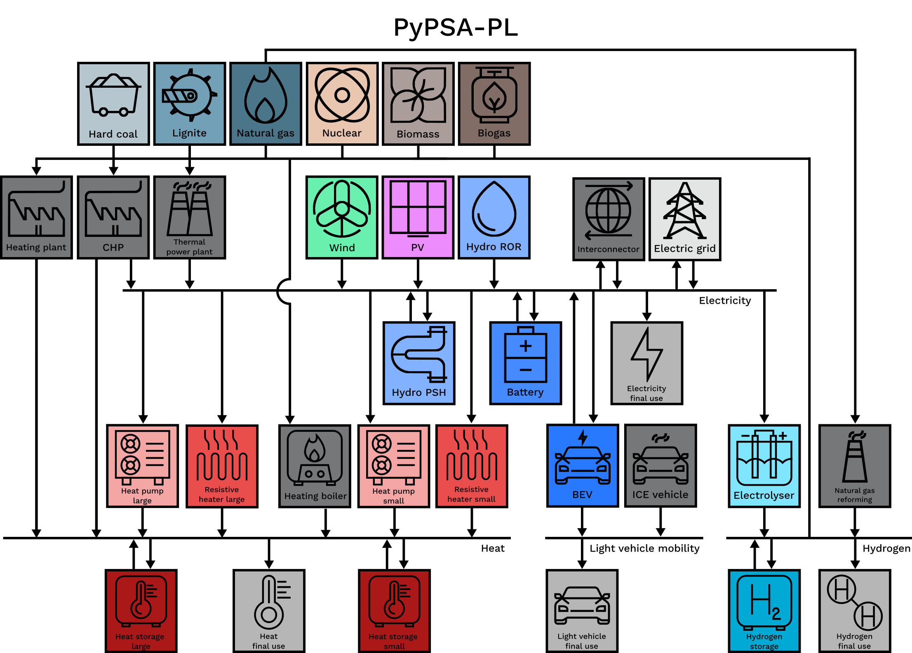

# PyPSA-PL: optimisation model of the Polish energy system

## Introduction

PyPSA-PL is an implementation of the energy modelling framework [PyPSA](https://pypsa.readthedocs.io)
shipped with a use-ready dataset tailored for the Polish energy system. PyPSA-PL can be used to plan optimal investments in the power, heating, hydrogen, and light vehicle sectors – given the final use demand together with capital and operation costs for assets – or just to optimise the hourly dispatch of the utility units – given the final use demand and operation costs only. That makes it a useful tool to investigate the feasibility of decarbonisation scenarios for the Polish energy system in which a large share of electricity is supplied by intermittent sources like wind and solar.

## Installation and usage

PyPSA-PL has been developed and tested using Python 3.10. The project dependencies can be installed using the [Poetry](https://python-poetry.org/) according to the [pyproject.toml](pyproject.toml) file. Alternatively, you can use any other Python package manager - the dependencies are also listed in the [requirements.txt](requirements.txt) file. Additionally, you will need to install an external solver (see [PyPSA manual](https://pypsa.readthedocs.io/en/latest/installation.html#getting-a-solver-for-optimisation)). 

The sample output data that is part of this repository have been generated using [HiGHS v1.5.3](https://github.com/ergo-code/highs#python) solver (with the default settings, the run takes about 30 minutes of computing time and up to 5 GB of RAM on a virtual machine). You can generate the sample output data yourself by running the [scripts/run_default.py](scripts/run_default.py) script. You can use this script as a starting point for your analyses.

The [user guide](docs/pypsa_pl_user_guide.pdf) provides an overview of PyPSA-PL structure, data requirements, and selected methodological details.

## Input data sources

This table lists the main data sources used for each input category. More detailed source attribution can be found in the input spreadsheets themselves.

Input | Source
-- | ----
installed capacity | ARE. (2023). Wynikowe informacje statystyczne. Agencja Rynku Energii. https://www.are.waw.pl/badania-statystycznewynikowe-informacje-statystyczne    PSE. (2023). Zasoby wytwórcze—Wg stanu na 2022.01.01. Informacje o zasobach wytwórczych KSE. Polskie Sieci Elektronergetyczne. https://www.pse.pl/dokumenty?safeargs=666f6c64657249643d3333393139#    URE. (2022). Instalacje odnawialnych źródeł energii. Urząd Regulacji Energetyki. https://www.ure.gov.pl/pl/oze/potencjal-krajowy-oze/8108,Instalacje-odnawialnych-zrodel-energii-stan-na-31-grudnia-2021-r.html    URE. (2023). Energetyka cieplna w liczbach. Urząd Regulacji Energetyki. https://www.ure.gov.pl/pl/cieplo/energetyka-cieplna-w-l
thermal units | Charkowska, Z., Przedlacki, W., Hetmański, M., Swoczyna, B. (2022). Database of thermal power plants and combined heat-and-power plants in Poland. Instrat. https://instrat.pl/en/power-plants-database-for-poland-expanded
fuel and CO2 prices | IEA. (2022). World Energy Outlook 2022. IEA. https://www.iea.org/reports/world-energy-outlook-2022
technology data | DAE. (2023). Technology Data. Danish Energy Agency. https://ens.dk/en/our-services/projections-and-models/technology-data
final use demand for energy carriers | Kubiczek, P. (2023). Instrat demand model. Instrat. https://github.com/instrat-pl/instrat-demand-model
electric load time series | ENTSO-E. (2023). Total Load—Day Ahead / Actual. Transparency Platform. https://transparency.entsoe.eu/load-domain/r2/totalLoadR2/show
wind and PV utilisation time series | De Felice, M. (2022). ENTSO-E Pan-European Climatic Database (PECD 2021.3) in Parquet format. Zenodo. https://doi.org/10.5281/zenodo.7224854    Gonzalez-Aparicio, I., Zucker, A., Careri, F., Monforti, F., Huld, T., Badger, J. (2021). EMHIRES dataset: Wind and solar power generation. Zenodo. https://doi.org/10.5281/zenodo.4803353
cross-border transmission capacity | ENTSO-E. (2023). TYNDP 2022 Project Collection. https://tyndp2022-project-platform.azurewebsites.net/projectsheets/transmission
installed capacity - neighbour countries | ENTSO-E & ENTSO-G. (2022). TYNDP 2022 Scenario Report. https://2022.entsos-tyndp-scenarios.eu/download

## Publications and full datasets

Here you can find the list of publications based on the PyPSA-PL results and links to the full datasets stored in Zenodo.

* Kubiczek P., Smoleń M. (2023). Poland cannot afford medium ambitions. Savings driven by fast deployment of renewables by 2030. Instrat Policy Paper 03/2023. https://instrat.pl/pypsa-march-2023/ 
* Kubiczek P. (2023). Baseload power. Modelling the costs of low flexibility of the Polish power system. Instrat Policy Paper 04/2023. https://instrat.pl/baseload-power/ 
* Kubiczek, P., Smoleń, M., Żelisko, W. (2023). Poland approaching carbon neutrality. Four scenarios for the Polish energy transition until 2040. Instrat Policy Paper 06/2023. https://instrat.pl/poland-2040/ 

## Acknowledgements

The current version of PyPSA-PL is a successor of the [PyPSA-PL v1](https://github.com/instrat-pl/pypsa-pl/tree/v1) developed by the Instrat Foundation in 2021. The following publications were based on the PyPSA-PL v1 results:

* Czyżak, P., Wrona, A. (2021). Achieving the goal. Coal phase-out in Polish power sector. Instrat Policy Paper 01/2021. https://instrat.pl/coal-phase-out
* Czyżak, P., Sikorski, M., Wrona, A. (2021). What’s next after coal? RES potential in Poland. Instrat Policy Paper 06/2021. https://instrat.pl/res-potential
* Czyżak, P., Wrona, A., Borkowski, M. (2021). The missing element. Energy security considerations. Instrat Policy Paper 09/2021. https://instrat.pl/energy-security

## License

The code is released under the [MIT license](LICENSE). The input and output data are released under the [CC BY 4.0 license](https://creativecommons.org/licenses/by/4.0/).

&copy; Instrat Foundation 2023

